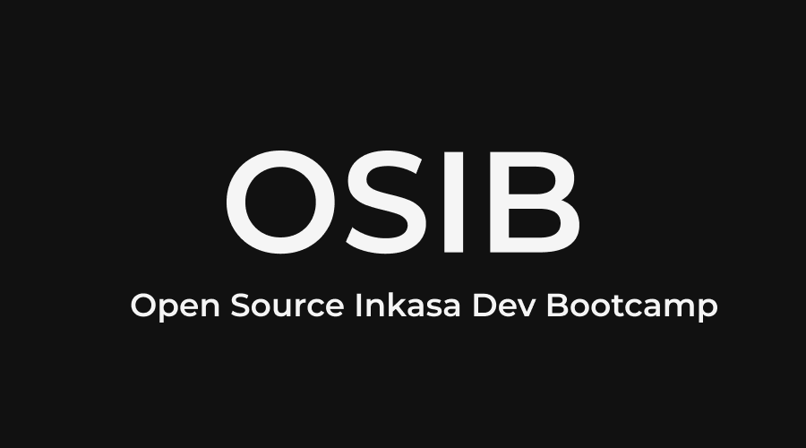

<h3 align="center">Open Source Inkasa Dev Bootcamp</h3>

  Caminho para uma educação autodidata gratuita em Frontend!

  

# Sumário <!-- omit in toc -->

- [Sobre](#sobre-)
- [Comunidade](#comunidade-)
- [Currículo](#currículo-)
- [Código de Conduta](#código-de-conduta-)
- [Sobre mim, esse projeto e você](#sobre-mim-esse-projeto-e-você-)
- [Equipe](#equipe-)

# Sobre <!-- omit in toc -->

O currículo da OSIB: Frontend é **uma educação GRATUITA completa para que você aprenda Frontend** usando materiais online. Não é meramente um tutorial ou um mini-curso. É para aqueles que desejam uma base adequada e completa em conceitos fundamentais para desenvolvimento Frontend usando Javascript, e para aqueles que têm disciplina, vontade e (o mais importante!) bons hábitos para obter essa educação, em grande parte por conta própria, mas com apoio de uma comunidade mundial de colegas aprendizes.

Ele é projetado focado em uma metodologia totalmente prática, onde você irá obter o conhecimento por meio de projetos ensinados passo a passo.

**Organização**. O currículo está estruturado da seguinte forma:

- _Starter_: Para os alunos já começarem o Bootcamp colocando a mão na massa, experimentando a área e vendo se é adequado para eles.

- _Essentials_: Corresponde ao core do Bootcamp, cobrindo assuntos que todos os cursos deveriam ter.

- _Intermediate_: Contém eletivas para serem feitas de acordo com os interesses do aluno.

- _Advanced_: Contém módulos focados em melhorar a qualidade dos códigos escritos pelo aluno, ao mesmo tempo em que aprimoram sua capacidade de resolução de problemas.

- _Projeto Final_: um projeto para os alunos validarem, consolidarem e exibirem seus conhecimentos, para serem avaliados por seus pares em todo o mundo.

- _Bônus_: Contém materiais extras que auxiliam no aprendizado.

**Custo**. Todo o material do bootcamp está disponível gratuitamente. Porém, esse projeto possui gastos. Caso você queira colaborar para que o mesmo continue existindo, considere apoiá-lo [clicando aqui](CONTRIBUTING.md).

Decida quando gastar ou quanto gastar com base em seu próprio tempo e orçamento; apenas lembre-se que você não pode comprar o sucesso!

**Processo**. Os alunos podem trabalhar o currículo sozinhos ou em grupos, em ordem ou fora de ordem.

- Recomendamos fazer todos os projetos dos núcleos _Starter_ e _Essentials_, apenas pulando um projeto se tiver certeza de que já aprendeu o conteúdo abordado anteriormente.
- Para simplificar, recomendamos trabalhar nos projetos na ordem de cima para baixo, pois eles já foram classificados topologicamente por seus pré-requisitos.
- Os módulos em _Intermediate_ são eletivos. Escolha um assunto em que você deseja se tornar um especialista e faça todos os projetos sob esse título. Você também pode criar seu próprio assunto personalizado, mas recomendamos obter validação da comunidade sobre o assunto escolhido.

**[Como contribuir](CONTRIBUTING.md)**

**[Conseguindo ajuda](HELP.md)** (Detalhes sobre nosso FAQ e Fórum)

**[Pessoas e Empresas que tornam esse trabalho possível](https://github.com/inkasadev/osib-thanks-pt)**

# Comunidade <!-- omit in toc -->

- Nós temos um Fórum! Nosso fórum deve ser sua primeira parada para conversar com outros alunos da OSIB: Frontend. Por que você não se apresenta agora? [Junte-se ao Fórum da OSIB: Frontend](extras/FORUM.md)
- Você também pode interagir por meio de issues do GitHub. Se houver um problema com um projeto ou uma mudança que precisa ser feita no currículo, este é o lugar para iniciar a conversa. [Leia mais aqui](CONTRIBUTING.md).

# Currículo <!-- omit in toc -->

**Versão do Currículo**: `0.3.4` (veja o [CHANGELOG](CHANGELOG.md))

- [Pré-requisitos](#pré-requisitos)
- [Starter](#starter)
  - [HTML/CSS Básico](#htmlcss-básico)
  - [Javascript Básico](#javascript-básico)
  - [Javascript: Clean Code](#javascript-clean-code)
- [Essentials](#essentials)
  - [Web Design Responsivo](#web-design-responsivo)
  - [Javascript Essentials](#javascript-essentials)
- [Intermediate](#intermediate)
  - [Javascript: ReactJS Básico](#javascript-reactjs-básico)
- [Advanced](#advanced)
  - [Matemática para Programadores](#matemática-para-programadores)
  - [Javascript: Design Patterns](#javascript-design-patterns)
  - [Javascript: Estruturas de Dados](#javascript-estruturas-de-dados)
- [Bônus](#bônus)
  - [Monitore o seu progresso](#monitore-o-seu-progresso)
  - [Qual a diferença?](#qual-a-diferença)
  - [Quizzes diários](#quizzes-diários)
  - [Projetos para Estudo](#projetos-para-estudo)
  - [The Best of Bolha Dev](#the-best-of-bolha-dev)
- [Projeto Final](#projeto-final)
  - [Avaliação](#avaliação)
  - [Trabalho cooperativo](#trabalho-cooperativo)
- [Parabéns!](#parabéns)

---

## Pré-requisitos

- [Starter](#starter) assume que o aluno possui conhecimentos como leitura e interpretação de texto e matemática de nível fundamental.
- [Intermediate](#intermediate) assume que o aluno já fez a totalidade do _Essentials_ e tem conhecimento suficiente agora para decidir quais eletivas tomar.

## Starter

Aqui você aprende a trabalhar com HTML, CSS e Javascript, tecnologias que serão úteis durante toda a sua jornada neste Bootcamp. Se você nunca escreveu um loop for ou não sabe o que é uma tag HTML, aqui é o lugar onde você irá aprender.

### HTML/CSS Básico

|                                                   Aula                                                   |  Tipo   | Duração  |      Esforço       |     Pré-requisitos      |                                                                                                 Discussão                                                                                                  |
| :------------------------------------------------------------------------------------------------------: | :-----: | :------: | :----------------: | :---------------------: | :--------------------------------------------------------------------------------------------------------------------------------------------------------------------------------------------------------: |
|                                             Comece por Aqui!                                             |  Vídeo  | Em Breve |      Em Breve      |         nenhum          |                                                                                                     -                                                                                                      |
|       [Como instalar o Chocolatey](https://github.com/inkasadev/osib-frontend-pt/wiki/Chocolatey)        |  Texto  |   15m    |       1 hora       |         nenhum          |                                                                                                     -                                                                                                      |
|     [Como instalar o VS Code](https://github.com/inkasadev/osib-frontend-pt/wiki/Visual-Studio-Code)     |  Texto  |   15m    |        30m         |         nenhum          |                                                                                                     -                                                                                                      |
|     [5 extensões do VS Code que você precisa instalar](https://www.youtube.com/watch?v=3CSlwnV19Xg)      |  Vídeo  |   10m    |        20m         | Como instalar o VS Code |                                                                                                     -                                                                                                      |
| [A extensão do VS Code que todo iniciante precisa instalar](https://www.youtube.com/watch?v=22Xl-zo_-A8) |  Vídeo  |    5m    |        10m         | Como instalar o VS Code |                                                                                                     -                                                                                                      |
|  [5 extensões do Google Chrome que você precisa instalar](https://www.youtube.com/watch?v=HVYLGA2nOzM)   |  Vídeo  |   10m    |        20m         |         nenhum          |                                                                                                     -                                                                                                      |
|                                           HTML para Iniciantes                                           |  Vídeo  | Em Breve |      Em Breve      |    Comece por Aqui!     |                                                                                                     -                                                                                                      |
|                                           CSS para Iniciantes                                            |  Vídeo  | Em Breve |      Em Breve      |  HTML para Iniciantes   |                                                                                                     -                                                                                                      |
|                   [Site Frontbox](https://github.com/inkasadev/frontbox-starter-files)                   | Projeto |  2h30m   | 2-4 horas / semana |   CSS para Iniciantes   | [fórum](https://github.com/inkasadev/osib-frontend-pt/discussions/categories/-g-perguntas-e-respostas?discussions_q=category%3A%22%28G%29+Perguntas+e+Respostas%22+label%3A%22projeto%3A+site+frontbox%22) |
|                   [Como colocar um ícone na aba do site](https://youtu.be/B-XhykQtkC4)                   |  Vídeo  |    6m    |       1 hora       |      Site Frontbox      |                                                                                                     -                                                                                                      |
|                   [Como enviar um projeto para o Github](https://youtu.be/EZN9-dKC5d8)                   |  Vídeo  |   27m    |      4 horas       |      Site Frontbox      |                                                                                                     -                                                                                                      |
|                        [Como hospedar um site HTML](https://youtu.be/CHgBusY7WHY)                        |  Vídeo  |    7m    |       1 hora       |      Site Frontbox      |                                                                                                     -                                                                                                      |

### Javascript Básico

|                                    Aula                                    |  Tipo   | Duração  |      Esforço       |       Pré-requisitos       |                                                                                                    Discussão                                                                                                    |
| :------------------------------------------------------------------------: | :-----: | :------: | :----------------: | :------------------------: | :-------------------------------------------------------------------------------------------------------------------------------------------------------------------------------------------------------------: |
|                         Javascript para Iniciantes                         |  Vídeo  | Em Breve |      Em Breve      |           nenhum           |                                                                                                        -                                                                                                        |
| [Placa 100k Youtube](https://github.com/inkasadev/placa100k-starter-files) | Projeto |  1h23m   |      4 horas       | Javascript para Iniciantes | [fórum](https://github.com/inkasadev/osib-frontend-pt/discussions/categories/-g-perguntas-e-respostas?discussions_q=category%3A%22%28G%29+Perguntas+e+Respostas%22+label%3A%22projeto%3A+placa+100k+youtube%22) |
|      [Jogo Genius](https://github.com/inkasadev/genius-starter-files)      | Projeto |  2h35m   | 2-4 horas / semana |     Placa 100k Youtube     |    [fórum](https://github.com/inkasadev/osib-frontend-pt/discussions/categories/-g-perguntas-e-respostas?discussions_q=category%3A%22%28G%29+Perguntas+e+Respostas%22+label%3A%22projeto%3A+jogo+genius%22)     |
|                             Calculadora Retrô                              | Projeto | Em Breve |      Em Breve      |     Placa 100k Youtube     |                                                                                                      fórum                                                                                                      |
|                               OSIB TodoList                                | Projeto | Em Breve |      Em Breve      |     Calculadora Retrô      |                                                                                                      fórum                                                                                                      |

### Javascript: Clean Code

|   Aula   |   Tipo   | Duração  | Esforço  | Pré-requisitos | Discussão |
| :------: | :------: | :------: | :------: | :------------: | :-------: |
| Em breve | Em breve | Em breve | Em breve |    Em breve    | Em breve  |

## Essentials

Todos os projetos do núcleo _Essentials_ são **obrigatórios**, salvo indicação em contrário.

### Web Design Responsivo

|                                      Aula                                      |  Tipo   | Duração  |      Esforço       | Pré-requisitos |                                                                                                    Discussão                                                                                                    |
| :----------------------------------------------------------------------------: | :-----: | :------: | :----------------: | :------------: | :-------------------------------------------------------------------------------------------------------------------------------------------------------------------------------------------------------------: |
|    [Site Meet Minas](https://github.com/inkasadev/meet-minas-starter-files)    | Projeto |  4h31m   | 2-4 horas / semana |     nenhum     |  [fórum](https://github.com/inkasadev/osib-frontend-pt/discussions/categories/-g-perguntas-e-respostas?discussions_q=category%3A%22%28G%29+Perguntas+e+Respostas%22+label%3A%22projeto%3A+site+meet+minas%22)   |
| [Site Clarim Diário](https://github.com/inkasadev/clarim-diario-starter-files) | Projeto | Em curso | 2-4 horas / semana |   Meet Minas   | [fórum](https://github.com/inkasadev/osib-frontend-pt/discussions/categories/-g-perguntas-e-respostas?discussions_q=category%3A%22%28G%29+Perguntas+e+Respostas%22+label%3A%22projeto%3A+site+clarim+diario%22) |

### Javascript Essentials

|                                       Aula                                        |         | Duração  |      Esforço       | Pré-requisitos |                                                                                                      Discussão                                                                                                      |
| :-------------------------------------------------------------------------------: | :-----: | :------: | :----------------: | :------------: | :-----------------------------------------------------------------------------------------------------------------------------------------------------------------------------------------------------------------: |
| [Dashboard Covid Brasil](https://github.com/inkasadev/covid-brasil-starter-files) | Projeto | Em curso | 2-4 horas / semana |   Meet Minas   | [fórum](https://github.com/inkasadev/osib-frontend-pt/discussions/categories/-g-perguntas-e-respostas?discussions_q=category%3A%22%28G%29+Perguntas+e+Respostas%22+label%3A%22projeto%3A+dashboard+covid+brasil%22) |

## Intermediate

Depois de concluir todos os módulos obrigatórios do _Essentials_, os alunos devem escolher um ou mais módulos do nível _Intermediate_ com base no interesse. Nem todo projeto de um módulo precisa ser feito, mas os alunos devem fazer todos os projetos relevantes para o campo em que pretendem entrar.

### Javascript: ReactJS Básico

|   Aula   |   Tipo   | Duração  | Esforço  | Pré-requisitos | Discussão |
| :------: | :------: | :------: | :------: | :------------: | :-------: |
| Em breve | Em breve | Em breve | Em breve |    Em breve    | Em breve  |

## Advanced

Os módulos do núcleo _Advanced_ são focados em melhorar a qualidade dos códigos escritos por você, ao mesmo tempo em que aprimoram a sua capacidade de resolução de problemas. Aqui você irá aprender sobre tópicos como Arquitetura, Design Patterns, Estruturas de Dados e até mesmo Matemática para Programadores.

Atente-se para o fato de que alguns módulos têm como pré-requisitos módulos do nível _Intermediate_.

### Matemática para Programadores

|   Aula   |   Tipo   | Duração  | Esforço  | Pré-requisitos | Discussão |
| :------: | :------: | :------: | :------: | :------------: | :-------: |
| Em breve | Em breve | Em breve | Em breve |    Em breve    | Em breve  |

### Javascript: Design Patterns

|   Aula   |   Tipo   | Duração  | Esforço  | Pré-requisitos | Discussão |
| :------: | :------: | :------: | :------: | :------------: | :-------: |
| Em breve | Em breve | Em breve | Em breve |    Em breve    | Em breve  |

### Javascript: Estruturas de Dados

|   Aula   |   Tipo   | Duração  | Esforço  | Pré-requisitos | Discussão |
| :------: | :------: | :------: | :------: | :------------: | :-------: |
| Em breve | Em breve | Em breve | Em breve |    Em breve    | Em breve  |

## Bônus

Nessa seção você encontra diversos bônus que tem como objetivo te auxiliar na sua jornada. Esses bônus vão desde um quadro para monitorar o seu progresso a quizzes diários e projetos para estudo.

### Monitore o seu progresso

1. Crie uma conta no [Trello](https://trello.com/).
2. Copie [este quadro](https://trello.com/b/fsJ6ndPo/osib-frontend-pt) para sua conta pessoal. Veja como copiar um quadro [aqui](https://help.trello.com/article/802-copying-cards-lists-or-boards).

Agora que você tem uma cópia do nosso quadro oficial, você só precisa passar os cartões para a coluna `Fazendo` ou `Concluído` à medida que avança nos seus estudos.

Também temos etiquetas para ajudá-lo a ter mais controle durante o processo. O significado de cada uma dessas etiquetas é:

- `Currículo Principal`: os cartões com essa etiqueta representam os projetos listados em nosso currículo.
- `Recursos Extras`: os cartões com essa etiqueta representam cursos/projetos que foram adicionados pelo aluno.
- `Módulo`: os cartões com essa etiqueta representam um módulo que temos em nosso currículo. Os cartões com etiquetas de `Módulo` servem apenas para ajudar na organização da coluna Currículo.

A intenção deste quadro é fornecer aos nossos alunos uma maneira de acompanhar seu progresso, e também a capacidade de mostrar seu progresso através de uma página pública para amigos, familiares, empregadores, etc. Você pode alterar o status do seu quadro para *público* ou *privado*.

### Qual a diferença?

É uma série de vídeos onde são explicadas as diferenças entre elementos do mundo da programação que aparentemente são iguais. [Clique aqui](https://github.com/inkasadev/qual-a-diferenca) para acessar o repositório.

###  Quizzes diários

São quizzes postados diariamente na aba comunidade do canal que tem com o objetivo de auxiliar na fixação do conteúdo ensinado no currículo, além de ser uma ótima forma do aluno manter um contato diário com o conteúdo. [Clique aqui](https://www.youtube.com/c/InkasaDev/community) para acessar a aba comunidade do canal e conferir os quizzes que já foram postados.

###  Projetos para Estudo

Pequenos projetos de frontend para estudo. Esses projetos são postados no Instagram e seu código em um Canal do Telegram. [Clique aqui](https://www.instagram.com/inkasadev/) para ver os vídeos dos projetos já postados e [clique aqui](https://t.me/inkasadev) para ter acesso ao código fonte desses projetos.

### The Best of Bolha Dev

Apesar do Twitter ser uma rede social extremamente tóxica, vez ou outra alguém produz algum conteúdo relevante por lá. Nesse repositório você encontra as melhores discussões que encontramos por lá, discussões que podem ajudar muito na sua jornada como desenvolvedor. [Clique aqui](https://github.com/inkasadev/best-of-bolha-dev) para acessar o repositório.

## Projeto Final

A OSIB: Frontend é focada em projetos. Cada um desses projetos irá prepará-lo para usar seu conhecimento resolvendo problemas do mundo real.

Ao fim de cada módulo (e quando completar o currículo da OSIB: Frontend), você deve pensar em um problema que pode resolver usando o conhecimento adquirido. Não apenas o trabalho real do projeto fica ótimo em um currículo, mas o projeto também irá validar e consolidar seu conhecimento. Você pode criar algo totalmente novo ou encontrar um projeto existente que precise de ajuda por meio de sites como [CodeTriage](https://www.codetriage.com/) ou [First Timers Only](https://www.firsttimersonly.com/).

### Avaliação

Ao concluir seu projeto ao final de um módulo ou do currículo:

- Envie as informações do seu projeto para [PROJECTS](PROJECTS.md) por meio de um pull request.
- Coloque a badge OSIB-Frontend no README do seu repositório! 

  - Markdown: ``
  - HTML: ``

- Use o fórum da [comunidade](#comunidade) para anunciá-lo aos seus colegas.

Solicite feedback de seus colegas da OSIB: Frontend. Você não será "avaliado" no sentido tradicional - todos têm suas próprias medidas para o que consideram um sucesso. O objetivo da avaliação é agir como seu primeiro anúncio ao mundo de que você é um desenvolvedor frontend e obter experiência em ouvir feedback – tanto positivo quanto negativo.

A avaliação do projeto final, criado após completar o currículo, tem um segundo objetivo: avaliar se a OSIB: Frontend, por meio de sua comunidade e currículo, é bem-sucedida em sua missão de orientar alunos independentes na obtenção de uma educação em desenvolvimento frontend a nível de mercado.

### Trabalho cooperativo

Você pode criar este projeto sozinho ou com outros alunos! Adoramos o trabalho cooperativo! Use nossos canais para se comunicar com outros bolsistas para combinar e criar novos projetos!

## Parabéns!

Depois de completar os requisitos do currículo acima, você terá concluído o equivalente a um Bootcamp completo em Desenvolvimento Frontend. Parabéns!

O que vem a seguir para você? As possibilidades são ilimitadas e sobrepostas:

- Procure um emprego como desenvolvedor!
- Confira as [leituras](extras/READINGS.md) de livros clássicos que você pode ler que irão aprimorar suas habilidades e expandir seu conhecimento.
- Participe de um encontro de desenvolvedores locais (por exemplo, via [meetup.com](https://www.meetup.com/)).

# Código de Conduta <!-- omit in toc -->

[Nosso Código de Conduta](CODE_OF_CONDUCT.md).

# Sobre mim, esse projeto e você <!-- omit in toc -->

Fala Pessoal! Meu nome é Phillipe Martins, mas pode me chamar de Inkasa.

Sou belorizontino, nascido e criado na periferia dessa cidade. Como dizia Emicida: "nasci preto, sem grana, num país de terceiro mundo", assim como muitos brasileiros por aí.

Cresci com a criminalidade na minha porta, perdendo inclusive alguns amigos para ela. Hoje, quando olho pra trás e me pergunto o porquê de eu não ter tido o mesmo fim que eles, eu percebo que a diferença foi só uma: privilégio. O privilégio de ter tido desde cedo uma mãe que, apesar de só ter conseguido terminar os estudos perto dos 50 anos, sempre valorizou a educação e se esforçou ao máximo para que eu entendesse que esse era o único caminho.

Por conta desse privilégio, eu acabei tendo outros. Consegui uma bolsa do PROUNI para fazer graduação e bolsa de pesquisa (FAPEMIG) e monitoria durante a graduação. Fiz mestrado com uma bolsa da CAPES e uma pós com uma bolsa interna da universidade. Tudo relacionado ao mundo da computação.

O meu objetivo com esse projeto é tentar ser o empurrão que você precisava para a sua transformação de vida rumo a um emprego melhor. Muitas pessoas desejam entrar para o mundo da programação, mas infelizmente não conseguem por conta do preço dos cursos atuais ou até mesmo pela falta de prática. **O que eu quero com esse bootcamp é oferecer gratuitamente o que muitos não te oferecem com você pagando!**

Porém, eu preciso de algo de você. Dedicação e, se possível, apoio.

Sobre dedicação, citando novamente o Emicida: "você é o único representante do seu sonho na face da terra, se isso não fizer você correr, eu não sei o que vai". Você precisa ter foco no seu objetivo e se dedicar a alcançá-lo. Eu sei que não é fácil. Talvez você tenha um trabalho que te exige muito, uma família pra cuidar e/ou outros deveres/obrigações que eu nem devo fazer ideia. Mas dedique–se, se esforce, lute! Eu te garanto que vai valer a pena!

Sobre apoio, como eu já disse, todo o material do bootcamp está disponível gratuitamente. Porém, esse projeto possui gastos. Caso você queira colaborar para que o mesmo continue existindo, eu te peço por favor que considere apoiá-lo. Entenda, porém, que o seu apoio não se limita à ajuda financeira. [Clique aqui](CONTRIBUTING.md) para saber as diferentes formas de apoiar esse projeto.

Eu espero de coração que você curta a jornada e lembre-se de que você não está sozinho nela. [Visite o fórum](extras/FORUM.md), crie grupos de estudos, tire dúvidas e forme amizades. Eu espero esbarrar com você por lá!

Tudo de melhor,  
Se cuida,  
Tmj! 👊🏾

# Equipe <!-- omit in toc -->

- **[Phillipe Martins (Inkasa Dev)](https://github.com/inkasadev)**: Fundador da OSIB

## Atribuição <!-- omit in toc -->
Partes deste projeto foram inspiradas nos seguintes trabalhos:

- [Freecodecamp](https://www.freecodecamp.org/learn)
- [OSSU](https://github.com/ossu/computer-science)
- [Front-end Brasil](https://github.com/frontendbr)
- [Awesome](https://github.com/sindresorhus/awesome)