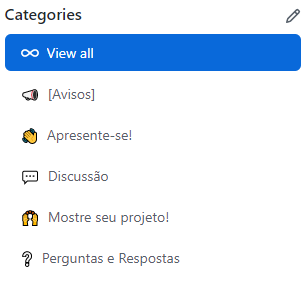

# Fórum <!-- omit in toc -->

Sejam bem vindos ao Fórum da OSIB: Frontend, um espaço para que vocês possam fazer novas amizades, tirar as suas dúvidas, crescer juntos e fazer aquele bom e velho network! 

> **Disclaimer:** _As opiniões publicadas no fórum são de inteira responsabilidade de seus autores e não refletem, necessariamente, o posicionamento da organização._

_____

# Sumário <!-- omit in toc -->

- [Antes de perguntar, pesquise!](#antes-de-perguntar-pesquise)
  - [Pesquise no fórum](#pesquise-no-fórum)
  - [Pesquise na internet](#pesquise-na-internet)
- [Como perguntar](#como-perguntar)
  - [Sobre o que perguntar](#sobre-o-que-perguntar)
  - [Outros pontos](#outros-pontos)
- [Como utilizar o Fórum](#como-utilizar-o-fórum)
  - [Como criar uma pergunta/discussão?](#como-criar-uma-perguntadiscussão)
  - [Sua pergunta foi respondida?](#sua-pergunta-foi-respondida)
  - [Ajude e seja reconhecido!](#ajude-e-seja-reconhecido)
  - [Sobre trechos de código...](#sobre-trechos-de-código)
- [Código de Conduta](#código-de-conduta)
- [Linguagem](#linguagem)
- [Como receber atualizações do Fórum](#como-receber-atualizações-do-fórum)

---

# Antes de perguntar, pesquise!

Uma habilidade essencial para os desenvolvedores é saber fazer boas pesquisas. Muitas das dúvidas de iniciantes podem ser respondidas com pesquisas simples, portanto antes de postar sua dúvida certifique-se de que fez as pesquisas necessárias e traga para dentro da pergunta/discussão os dados que encontrou e os dados que não encontrou sobre o assunto.

## Pesquise no fórum

1. Utilize a função de busca no topo desse repositório (certifique-se de não estar em um *fork*).

2. Pesquise assuntos próximos, talvez sua dúvida possa ter sido respondida em alguma pergunta/discussão parecida.

## Pesquise na internet

1. Caso sua dúvida seja sobre uma linguagem ou ferramenta específica, busque sua dúvida na documentação oficial dessa linguagem/ferramenta.

2. Caso o item acima não resolva, utilize preferencialmente o [Google](https://www.google.com).

3. Tente pesquisar em inglês, nem que pra isso precise recorrer ao [Google Translate](https://translate.google.com).

4. Dê preferência para resultados de documentações oficiais e fóruns especializados, exemplo:
  - [Mozilla Developer Network (MDN)](https://developer.mozilla.org/pt-BR/)
  - [StackOverflow](https://stackoverflow.com/)

# Como perguntar

Concentre suas perguntas em problemas reais. Inclua detalhes sobre o que você tentou e exatamente o que você está tentando fazer.

O ideal é que antes de criar uma dúvida você tente resolver o problema sozinho, na grande maioria das vezes uma breve busca no Google pode te ajudar a encontrar uma solução.

## Sobre o que perguntar

Pergunte sobre:
- Como resolver um determinado problema ex: `Como alterar a cor de fundo de uma div com CSS`.
- Como executar uma determinada tarefa ex: `Como consumir um webservice REST com JavaScript`.
- Como otimizar um trecho de código ex: `Como percorrer todas as propriedades de um objeto rapidamente`.

> **Atenção:** _**Não peça para perguntar! Não há necessidade de escrever "Existe alguém que possa me ajudar com X?", basta perguntar sobre X**._

## Outros pontos

- Lembre-se de pesquisar bastante antes de abrir uma pergunta/discussão, existem boas chances da sua dúvida já ter sido respondida e estar documentada pela internet.

- Discussões são sempre bem-vindas, desde que respeitem o nosso [Código de Conduta](CODE_OF_CONDUCT.md) e não fujam do propósito da comunidade. Ao formular uma discussão, tente ser o mais direto possível sobre o que você pretende abordar e, se necessário, abra mais de uma thread, uma para cada assunto.

- Escreva o português de forma correta e bem pontuada.

- Evite sair do escopo inicial da pergunta/discussão. Caso necessário, crie uma nova pergunta/discussão e mencione a pergunta/discussão anterior.

- Se precisar de ajuda em um código, forneça trechos, [Gists](https://gist.github.com/) e lembre-se, ninguém tem a obrigação de resolver seu problema.

- Não faça um monólogo que só fala de si mesmo. Interaja com as respostas, cite pessoas, gere uma discussão saudável e construtiva. Quanto mais informações, mais rico nosso ambiente será e ajudará mais pessoas.

# Como utilizar o Fórum

## Como criar uma pergunta/discussão?

Na aba **Discussions** basta clicar no botão **New discussion**, na próxima página, basta escolher entre as 4 diferentes categorias.

  

- **[Avisos]**: Atualizações da Staff para a comunidade
- **Apresente-se**: Nos diga quem é você, o que você faz, porque se interessou pela área, etc...
- **Discussão**: Proponha discussões ou reflexões sobre assuntos relacionados a profissão.
- **Mostre seu projeto**: Mostre o projeto que você fez no final de algum módulo ou o seu projeto final, peça feedback, compartilhe sua experiência e avalie o projeto de outros alunos.
- **Perguntas e Respostas**: Pergunte e ajude a comunidade! =D

Após selecionar a categoria, basta adicionar um título bem detalhado e caprichar no texto. Lembre-se de seguir [os passos corretos](#como-perguntar) ao criar uma pergunta/discussão.

## Sua pergunta foi respondida?

Se alguém respondeu sua pergunta corretamente, não deixe de marcar a resposta como respondida. Isso ajuda a filtrar as perguntas, além de dar um ponto para o colega que te ajudou e incentivar que as pessoas se ajudem mais e mais.

  

## Ajude e seja reconhecido!

Toda vez que alguém faz uma pergunta e sua resposta for marcada como correta, você ganha um ponto. Quanto mais pontos você juntar, maior a chance de você aparecer no ranking das pessoas que mais ajudam.

  

Além disso, seu perfil no GitHub também irá mostrar quantas discussões você já respondeu!

  

## Sobre trechos de código...

Para facilitar a visualização de quem vai ler sua pergunta/discussão, coloque seu código no [Codepen](https://codepen.io/) (recomendadíssimo) ou no [Gist](https://gist.github.com/). Assim quem for te ajudar conseguirá ver seu código em funcionamento, facilitando as dicas.

# Código de Conduta

[Nosso Código de Conduta](CODE_OF_CONDUCT.md).

# Linguagem

**Todas** as discussões devem ser abertas e respondidas em **pt-br**.

# Como receber atualizações do Fórum

Você pode receber atualizações do Fórum no seu email ou via notificações do GitHub, basta clicar em **Watch**, em seguida, basta ir em **Custom** e marcar a opção de **Discussions**.

_____

